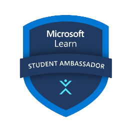
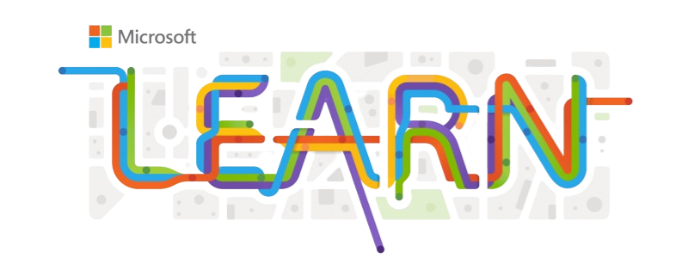

# Microsoft Opportunities for Students
---

---
## [For Students and Graduates](https://careers.microsoft.com/v2/global/en/programs/students.html?wt.mc_id=studentamb_211042)
- [**University internships**](https://careers.microsoft.com/v2/global/en/universityinternship?wt.mc_id=studentamb_211042) You can apply for an internship at Microsoft and work on projects that matter, learn from experts, and experience the culture of the company. Internships are available in all job families and solution areas, and for students in Bachelor's, Master's, MBA, PhD programs. 
- [**PhD internships**](https://careers.microsoft.com/v2/global/en/phdinternship?wt.mc_id=studentamb_211042) If you are pursuing a PhD and want to explore what it's like to work at Microsoft, you can join either the product teams or the Microsoft Research (MSR) teams. You will be able to conduct cutting-edge research or engineer a new product, and collaborate with other researchers and engineers.
- [**Microsoft Aspire Experience**](https://careers.microsoft.com/v2/global/en/recentgraduate?wt.mc_id=studentamb_211042) This is an onboarding experience for students and graduates who join Microsoft after completing their undergraduate or MBA programs. You will receive training, mentoring, and networking opportunities to help you grow your career at Microsoft.

## [Global programs](https://careers.microsoft.com/v2/global/en/exploremicrosoft?wt.mc_id=studentamb_211042)

These are programs that aim to inspire, empower, and connect students from around the world who are passionate about technology and innovation. Some examples are:

- [**Imagine Cup**](https://imaginecup.microsoft.com?wt.mc_id=studentamb_211042): A global competition where you can create a tech solution to address a social or environmental issue and win great prizes. 
- [**Student ambassadors program**](https://studentambassadors.microsoft.com?wt.mc_id=studentamb_211042): A community of students who learn new skills, share their knowledge, and network with other students and professionals. 
- [**ACE rotational program**](https://careers.microsoft.com/students/us/en/aceprogram?wt.mc_id=studentamb_211042): A two-year program for recent graduates who want to explore different roles and teams within Microsoft's engineering organization. 
- [**HR rotational program**](https://careers.microsoft.com/students/us/en/hrprogram?wt.mc_id=studentamb_211042): A two-year program for recent graduates who want to explore different roles and teams within Microsoft's human resources organization. 
- [**Finance rotational program**](https://careers.microsoft.com/students/us/en/financeprogram?wt.mc_id=studentamb_211042): A two-year program for recent graduates who want to explore different roles and teams within Microsoft's finance organization.
  

## [Technology & Learning Tools for Students](https://www.microsoft.com/en-us/education/products/office/default.aspx?wt.mc_id=studentamb_211042)

These are resources that can help you learn new skills, find technical documentation, access online courses, and get support from Microsoft Education:

- [**Microsoft Learn**](https://learn.microsoft.com?wt.mc_id=studentamb_211042) A free online platform that provides interactive learning paths and modules for various Microsoft products and services, such as Azure, Power Platform, Dynamics 365, and more. You can learn at your own pace, earn points and badges, and get certified to showcase your skills.
- [**Microsoft Startups**](https://www.microsoft.com/startups?wt.mc_id=studentamb_211042) A program that supports startups at every stage of their journey, from idea to exit. It offers free access to Azure credits, development tools, software, mentorship, and co-selling opportunities. It also features the Founders Hub, a digital platform that provides resources and guidance to help founders build and grow their startups.
- [**Student Hub**](https://learn.microsoft.com/training/student-hub?wt.mc_id=studentamb_211042) A site that helps student entrepreneurs and tech enthusiasts expand their technical knowledge and skills in the field of AI. It offers free access to Azure for Students, learning modules on various AI topics and tools, career paths exploration, and opportunities to connect with the Microsoft student developer community.
- [**Microsoft Reactor**](https://developer.microsoft.com/reactor?wt.mc_id=studentamb_211042) A community that connects developers and startups with the latest tech and industry experts. It offers virtual and in-person events on topics such as cloud, AI, mixed reality, DevOps, and more. You can learn new skills, meet new peers, and find career mentorship through Microsoft Reactor.

## [Opportunities for Computer Science Students](https://www.microsoft.com/teals?wt.mc_id=studentamb_211042)

The opportunities for computer science students are various and exciting. You can participate in competitions, hackathons, workshops, scholarships, and internships that are related to computer science and technology. You can also learn from experts, mentors, and peers who share your passion and curiosity. Some of the benefits of these opportunities are:

- You can improve your coding skills and learn new technologies.
- You can showcase your creativity and innovation by solving real-world problems or creating original projects.
- You can network with other students and professionals who can offer you guidance, feedback, and support.
- You can gain valuable experience and exposure that can help you advance your academic or career goals.

If you are interested in finding these opportunities, you can use the TEALS website. TEALS is a program that connects high school teachers with tech industry volunteers to create sustainable computer science programs. On their website, you can search for opportunities by category, location, deadline, and eligibility. You can also sign up for their newsletter to get updates on new opportunities.

---

#### About the Author

